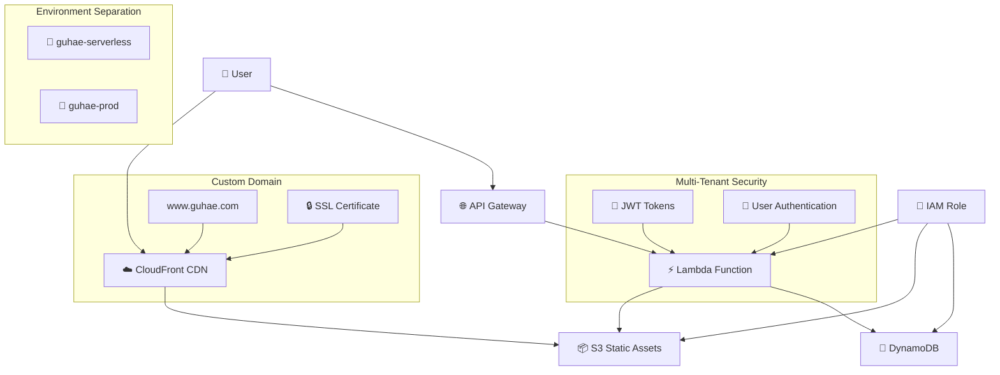
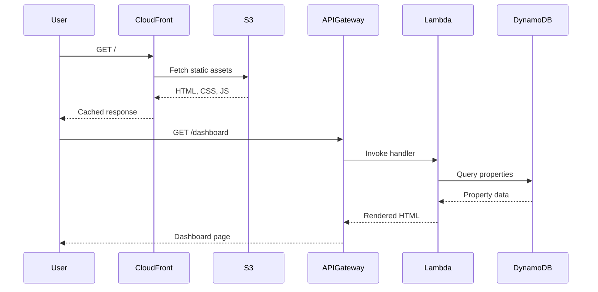
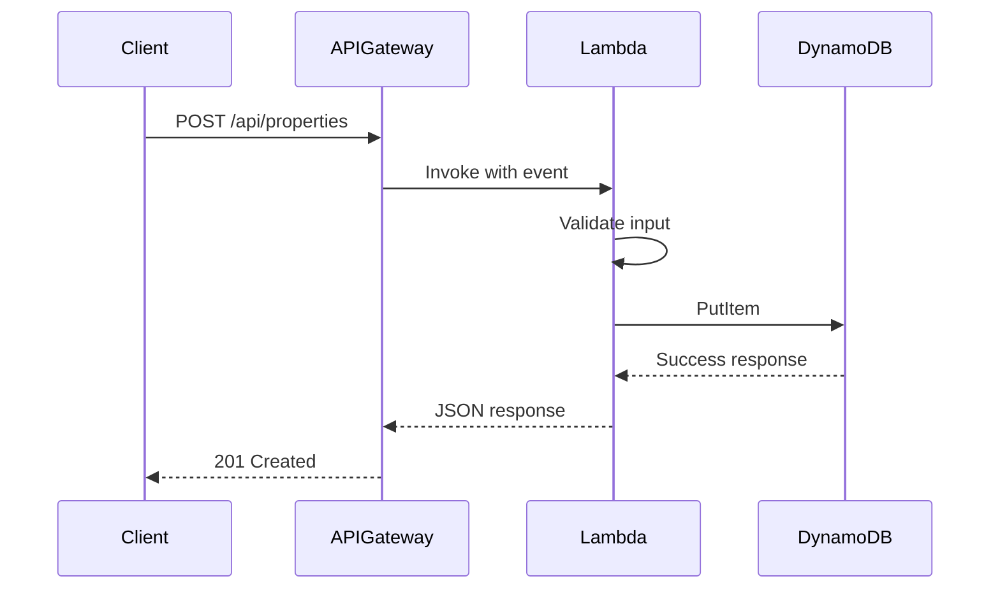

# 🏗️ Architecture Overview

## System Architecture

The Guhae rental property management application follows a serverless architecture pattern on AWS, providing scalability, cost-efficiency, and minimal operational overhead. The application supports both development and production environments with separate stacks, multi-tenant security, comprehensive finance management, and custom domain integration.

## High-Level Architecture



## Component Details

### 🌐 Frontend Layer

#### CloudFront Distribution

- **Purpose**: Global CDN for static asset delivery
- **Resource Name**: `{StackName}-web-distribution`
- **Custom Domain Support**: Configurable via CloudFormation parameters
- **SSL Integration**: AWS Certificate Manager integration
- **Features**:
  - Global edge caching
  - HTTPS termination and redirection
  - Custom domain aliases (www.guhae.com for production)
  - Compression and optimization
  - Development and production environment separation

#### Static Website Hosting

- **Storage**: S3 bucket (`{StackName}-assets-{AccountId}`)
- **Content**: HTML, CSS, JavaScript, images, favicons
- **Access**: Public read via bucket policy
- **Caching**: Leverages CloudFront for performance
- **Pages**:
  - `index.html`: Landing page with login/registration
  - `dashboard.html`: Main property management interface
  - `property_detail.html`: Individual property details with Finance system
  - `add_property.html`: Property creation form
  - `profile.html`: User profile management

### 🔗 API Layer

#### API Gateway

- **Type**: REST API
- **Resource Name**: `{StackName}-rental-property-api`
- **Stage**: `prod`
- **Features**:
  - CORS enabled for browser access
  - Request/response transformation
  - Throttling and rate limiting
  - Integration with Lambda proxy
  - Multi-tenant routing with JWT authentication

#### Lambda Function

- **Name**: `{StackName}-rental-property-api-handler`
- **Runtime**: Python 3.9
- **Handler**: `lambda_function.lambda_handler`
- **Features**:
  - Unified handler for API and web requests
  - Route-based request processing
  - JWT-based authentication and authorization
  - Multi-tenant data isolation
  - Finance management endpoints
  - User management and property CRUD operations

### 💾 Data Layer

#### DynamoDB Table

- **Name**: `{StackName}-rental-properties`
- **Type**: NoSQL document database
- **Billing**: Pay-per-request (on-demand)
- **Key Schema**:
  - Partition Key: `property_id` (String)
- **Global Secondary Index**:
  - `owner_id-index`: For multi-tenant data isolation
  - Partition Key: `owner_id` (String)
  - Sort Key: `created_at` (String)
- **Features**:
  - Automatic scaling
  - Built-in security with encryption at rest
  - Millisecond latency
  - Multi-tenant data isolation
  - Finance and loan data storage

#### Data Model

```json
{
  "property_id": "uuid-string",
  "owner_id": "user-uuid",
  "title": "Property Title",
  "address": "Full Address",
  "rent": 1200,
  "description": "Property description",
  "bedrooms": 2,
  "bathrooms": 1,
  "status": "available|rented|maintenance",
  "created_at": "2024-01-01T00:00:00Z",
  "updated_at": "2024-01-01T00:00:00Z",
  "finance": {
    "ownership_type": "Individual|Joint|LLC|Corporation",
    "ownership_status": "Owned|Financed|Rented",
    "purchase_info": {
      "purchase_price": 250000,
      "purchase_date": "2023-01-15",
      "builder": "ABC Construction",
      "seller": "John Doe",
      "buyer_agent": "Jane Smith",
      "title_company": "Secure Title Co"
    },
    "loans": [
      {
        "loan_id": "uuid",
        "financial_institution": "Bank Name",
        "loan_type": "Conventional|FHA|VA|Jumbo",
        "loan_amount": 200000,
        "interest_rate": 3.5,
        "loan_term": 30,
        "monthly_payment": 1200,
        "start_date": "2023-01-15",
        "status": "Active|Ended"
      }
    ]
  }
}
```

#### User Model

```json
{
  "user_id": "uuid-string",
  "email": "user@example.com",
  "password_hash": "bcrypt-hash",
  "first_name": "John",
  "last_name": "Doe",
  "phone": "+1234567890",
  "created_at": "2024-01-01T00:00:00Z",
  "updated_at": "2024-01-01T00:00:00Z"
}
```

### 🔐 Security Layer

#### Multi-Tenant Security

- **JWT Authentication**: Token-based user authentication
- **User Isolation**: owner_id-based data segregation
- **Authorization**: Per-request ownership verification
- **Session Management**: Secure token storage and validation

#### IAM Role & Policies

- **Lambda Execution Role**: `{StackName}-lambda-execution-role`
- **Deployment Policy**: `GuhaeDeploymentPolicy` (comprehensive permissions)
- **Principle**: Least privilege access with resource prefixing
- **Environment Separation**: Separate IAM resources per stack

## Environment Architecture

### 🏗️ Multi-Environment Strategy

#### Development Environment (`guhae-serverless`)

- **Purpose**: Testing and development
- **URL**: AWS-generated CloudFront domain
- **Database**: Separate DynamoDB table for dev data
- **Isolation**: Complete infrastructure separation from production

#### Production Environment (`guhae-prod`)

- **Purpose**: Live application for end users
- **URL**: Custom domain (www.guhae.com)
- **SSL**: AWS Certificate Manager with DNS validation
- **Database**: Separate production DynamoDB table
- **Monitoring**: Enhanced logging and alerting

### 🔄 Deployment Strategy

#### Infrastructure Separation

```yaml
# Development Stack Resources
guhae-serverless-assets-{AccountId}      # S3 Bucket
guhae-serverless-rental-properties       # DynamoDB Table
guhae-serverless-lambda-execution-role   # IAM Role

# Production Stack Resources
guhae-prod-assets-{AccountId}            # S3 Bucket
guhae-prod-rental-properties             # DynamoDB Table
guhae-prod-lambda-execution-role         # IAM Role
```

## Request Flow

### 🌐 Web Request Flow



### 📡 API Request Flow



## Scalability & Performance

### 🚀 Auto Scaling

- **API Gateway**: Handles up to 10,000 requests/second
- **Lambda**: Automatic concurrency scaling (1000 concurrent executions)
- **DynamoDB**: On-demand scaling based on traffic
- **CloudFront**: Global edge locations for low latency

### ⚡ Performance Characteristics

- **Cold Start**: ~500ms (2KB optimized packaging)
- **Warm Request**: ~50-100ms
- **Database Latency**: <10ms (single-digit milliseconds)
- **CDN Cache Hit**: ~50ms globally
- **Deployment Speed**: ~10 seconds (code updates with 2KB packages vs minutes with 13MB)

### 💰 Cost Optimization

- **Pay-per-use**: No idle costs (~$0.50/month idle)
- **DynamoDB**: On-demand billing (pay-per-request)
- **Lambda**: Per-invocation and duration pricing
- **S3**: Storage and transfer costs only
- **Package Efficiency**: 99.98% size reduction (2KB vs 13MB packages)
- **CloudFront**: Pay-per-GB and request

## Deployment Architecture

### 🏗️ Infrastructure as Code

```yaml
# CloudFormation Template Structure
Resources:
  # Compute
  RentalPropertyApiHandler: # Lambda Function
  RentalPropertyLambdaExecutionRole: # IAM Role

  # API & Web
  RentalPropertyApiGateway: # API Gateway
  RentalPropertyWebDistribution: # CloudFront

  # Storage
  RentalPropertiesTable: # DynamoDB
  RentalPropertyAssetsBucket: # S3 Bucket
```

### 🔄 Deployment Pipeline

1. **Code Packaging**: Zip Lambda function with dependencies
2. **Infrastructure**: Deploy/update CloudFormation stack
3. **Code Deployment**: Update Lambda function code
4. **Static Assets**: Sync files to S3 bucket
5. **Validation**: Test API endpoints

## Security Architecture

### 🛡️ Security Layers

1. **Network**: HTTPS/TLS encryption in transit
2. **Authentication**: IAM-based access control
3. **Authorization**: Resource-based policies
4. **Data**: Encryption at rest (DynamoDB, S3)
5. **Monitoring**: CloudWatch logs and metrics

### 🔐 IAM Policy Structure

```json
{
  "Version": "2012-10-17",
  "Statement": [
    {
      "Effect": "Allow",
      "Action": ["dynamodb:*"],
      "Resource": "arn:aws:dynamodb:*:*:table/guhae-*"
    },
    {
      "Effect": "Allow",
      "Action": ["s3:*"],
      "Resource": "arn:aws:s3:::guhae-*"
    }
  ]
}
```

## Monitoring & Observability

### 📊 Metrics & Logging

- **CloudWatch Logs**: Lambda function execution logs
- **API Gateway**: Request/response logging and metrics
- **DynamoDB**: Performance and capacity metrics
- **CloudFront**: Cache hit ratios and edge performance

### 🚨 Alerting

- **Lambda Errors**: Function error rate monitoring
- **API Latency**: Response time thresholds
- **DynamoDB**: Throttling and capacity alerts
- **Cost**: Billing threshold notifications

## Technology Stack

### 🐍 Backend

- **Language**: Python 3.9
- **Framework**: Flask (lightweight web framework)
- **AWS SDK**: Boto3 for AWS service integration
- **Templates**: Jinja2 templating engine

### 🌐 Frontend

- **HTML5**: Semantic markup with accessibility features
- **CSS3**: Modern styling with Bootstrap 5.3 framework
- **JavaScript ES6+**: Modern vanilla JavaScript with modular architecture
- **Authentication**: JWT token management and session handling
- **State Management**: Local storage and session management
- **UI Framework**: Bootstrap with Font Awesome icons
- **Architecture**: MVC pattern with service layer abstraction

### ☁️ AWS Services

- **Compute**: Lambda (serverless functions)
- **API**: API Gateway (REST API management)
- **Database**: DynamoDB (NoSQL database)
- **Storage**: S3 (object storage)
- **CDN**: CloudFront (content delivery)
- **Security**: IAM (identity and access management)
- **Monitoring**: CloudWatch (logs and metrics)

## Development Patterns

### 🎯 Design Patterns

- **MVC Architecture**: Separation of concerns
- **Repository Pattern**: Data access abstraction
- **Factory Pattern**: Object creation
- **Singleton**: Resource initialization

### 📁 Code Organization

```
src/
├── lambda_function.py          # Main handler with JWT auth
├── config.py                   # Configuration management
├── validation_config.py        # Centralized validation configuration
├── services/                   # Business logic layer
│   ├── __init__.py
│   ├── database.py            # Data access with multi-tenant support
│   └── properties.py          # Property and finance domain logic
├── utils/                     # Helper functions
│   ├── __init__.py
│   ├── aws_helpers.py         # AWS service utilities
│   └── validators.py          # Input validation
└── frontend/                  # Static web assets
    ├── index.html             # Landing/login page
    ├── dashboard.html         # Main property dashboard
    ├── property_detail.html   # Property details with finance
    ├── add_property.html      # Property creation form
    ├── profile.html           # User profile management
    ├── favicon.svg            # Application icon
    └── static/
        ├── css/
        │   ├── style.css      # Main application styles
        │   └── dashboard.css  # Dashboard-specific styles
        └── js/
            ├── auth.js        # Authentication management
            ├── models.js      # Data models and validation
            ├── services.js    # API service layer
            ├── utils.js       # Utility functions
            ├── components.js  # Reusable UI components
            ├── dashboard.js   # Dashboard functionality
            ├── property_detail.js # Property detail page logic
            ├── add_property.js    # Property creation logic
            ├── profile.js     # User profile management
            └── data.js        # Data management utilities
```

## Future Enhancements

### 🚀 Planned Features

1. **Authentication**: Cognito user pools
2. **Multi-tenancy**: Tenant isolation
3. **File Upload**: Property images and documents
4. **Notifications**: SNS/SES integration
5. **Analytics**: Real-time dashboards
6. **Mobile API**: GraphQL endpoints

### 📈 Scalability Roadmap

1. **Microservices**: Service decomposition
2. **Event Sourcing**: Event-driven architecture
3. **CQRS**: Command Query Responsibility Segregation
4. **API Versioning**: Backward compatibility
5. **Global Distribution**: Multi-region deployment

## Related Documentation

- [Deployment Guide](DEPLOYMENT.md) - Infrastructure deployment
- [Development Guide](DEVELOPMENT.md) - Local development setup
- [Security Setup](SECURITY.md) - IAM configuration
- [API Reference](API.md) - Complete API documentation
- [Troubleshooting](TROUBLESHOOTING.md) - Common issues and solutions
