# 🏗️ Architecture Overview

## System Architecture

The Guhae rental property management application follows a serverless architecture pattern on AWS, providing scalability, cost-efficiency, and minimal operational overhead.

## High-Level Architecture

```mermaid
graph TB
    User[👤 User] --> CF[☁️ CloudFront CDN]
    User --> API[🌐 API Gateway]

    CF --> S3[📦 S3 Static Assets]
    API --> Lambda[⚡ Lambda Function]
    Lambda --> DDB[💾 DynamoDB]
    Lambda --> S3

    IAM[🔐 IAM Role] --> Lambda
    IAM --> DDB
    IAM --> S3
```



## Component Details

### 🌐 Frontend Layer

#### CloudFront Distribution

- **Purpose**: Global CDN for static asset delivery
- **Resource Name**: `guhae-serverless-web-distribution`
- **Features**:
  - Global edge caching
  - HTTPS termination
  - Custom domain support (configurable)
  - Compression and optimization

#### Static Website Hosting

- **Storage**: S3 bucket (`guhae-serverless-assets-{AccountId}`)
- **Content**: HTML, CSS, JavaScript, images
- **Access**: Public read via bucket policy
- **Caching**: Leverages CloudFront for performance

### 🔗 API Layer

#### API Gateway

- **Type**: REST API
- **Resource Name**: `guhae-serverless-rental-property-api`
- **Stage**: `prod`
- **Features**:
  - CORS enabled for browser access
  - Request/response transformation
  - Throttling and rate limiting
  - Integration with Lambda proxy

#### Lambda Function

- **Name**: `guhae-serverless-rental-property-api-handler`
- **Runtime**: Python 3.9
- **Handler**: `lambda_function.lambda_handler`
- **Features**:
  - Unified handler for API and web requests
  - Route-based request processing
  - Template rendering for web pages
  - JSON API responses

### 💾 Data Layer

#### DynamoDB Table

- **Name**: `guhae-serverless-rental-properties`
- **Type**: NoSQL document database
- **Billing**: Pay-per-request (on-demand)
- **Key Schema**:
  - Partition Key: `property_id` (String)
- **Features**:
  - Automatic scaling
  - Built-in security
  - Millisecond latency
  - Backup and restore

#### Data Model

```json
{
  "property_id": "uuid-string",
  "title": "Property Title",
  "address": "Full Address",
  "rent": 1200,
  "description": "Property description",
  "bedrooms": 2,
  "bathrooms": 1,
  "status": "available|rented|maintenance",
  "created_at": "2024-01-01T00:00:00Z",
  "updated_at": "2024-01-01T00:00:00Z"
}
```

### 🔐 Security Layer

#### IAM Role & Policies

- **Lambda Execution Role**: `guhae-serverless-lambda-execution-role`
- **Managed Policy**: `GuhaeMinimalPolicy` (4.7KB comprehensive permissions)
- **Principle**: Least privilege access
- **Scope**: Resources prefixed with `guhae-*`

## Request Flow

### 🌐 Web Request Flow


### 📡 API Request Flow


## Scalability & Performance

### 🚀 Auto Scaling

- **API Gateway**: Handles up to 10,000 requests/second
- **Lambda**: Automatic concurrency scaling (1000 concurrent executions)
- **DynamoDB**: On-demand scaling based on traffic
- **CloudFront**: Global edge locations for low latency

### ⚡ Performance Characteristics

- **Cold Start**: ~500ms (optimized Python packaging)
- **Warm Request**: ~50-100ms
- **Database Latency**: <10ms (single-digit milliseconds)
- **CDN Cache Hit**: ~50ms globally

### 💰 Cost Optimization

- **Pay-per-use**: No idle costs
- **DynamoDB**: On-demand billing
- **Lambda**: Per-invocation and duration pricing
- **S3**: Storage and transfer costs only
- **CloudFront**: Pay-per-GB and request

## Deployment Architecture

### 🏗️ Infrastructure as Code

```yaml
# CloudFormation Template Structure
Resources:
  # Compute
  RentalPropertyApiHandler: # Lambda Function
  RentalPropertyLambdaExecutionRole: # IAM Role

  # API & Web
  RentalPropertyApiGateway: # API Gateway
  RentalPropertyWebDistribution: # CloudFront

  # Storage
  RentalPropertiesTable: # DynamoDB
  RentalPropertyAssetsBucket: # S3 Bucket
```

### 🔄 Deployment Pipeline

1. **Code Packaging**: Zip Lambda function with dependencies
2. **Infrastructure**: Deploy/update CloudFormation stack
3. **Code Deployment**: Update Lambda function code
4. **Static Assets**: Sync files to S3 bucket
5. **Validation**: Test API endpoints

## Security Architecture

### 🛡️ Security Layers

1. **Network**: HTTPS/TLS encryption in transit
2. **Authentication**: IAM-based access control
3. **Authorization**: Resource-based policies
4. **Data**: Encryption at rest (DynamoDB, S3)
5. **Monitoring**: CloudWatch logs and metrics

### 🔐 IAM Policy Structure

```json
{
  "Version": "2012-10-17",
  "Statement": [
    {
      "Effect": "Allow",
      "Action": ["dynamodb:*"],
      "Resource": "arn:aws:dynamodb:*:*:table/guhae-*"
    },
    {
      "Effect": "Allow",
      "Action": ["s3:*"],
      "Resource": "arn:aws:s3:::guhae-*"
    }
  ]
}
```

## Monitoring & Observability

### 📊 Metrics & Logging

- **CloudWatch Logs**: Lambda function execution logs
- **API Gateway**: Request/response logging and metrics
- **DynamoDB**: Performance and capacity metrics
- **CloudFront**: Cache hit ratios and edge performance

### 🚨 Alerting

- **Lambda Errors**: Function error rate monitoring
- **API Latency**: Response time thresholds
- **DynamoDB**: Throttling and capacity alerts
- **Cost**: Billing threshold notifications

## Technology Stack

### 🐍 Backend

- **Language**: Python 3.9
- **Framework**: Flask (lightweight web framework)
- **AWS SDK**: Boto3 for AWS service integration
- **Templates**: Jinja2 templating engine

### 🌐 Frontend

- **HTML5**: Semantic markup
- **CSS3**: Modern styling with Flexbox/Grid
- **JavaScript**: Vanilla JS for interactivity
- **Bootstrap**: Responsive UI framework

### ☁️ AWS Services

- **Compute**: Lambda (serverless functions)
- **API**: API Gateway (REST API management)
- **Database**: DynamoDB (NoSQL database)
- **Storage**: S3 (object storage)
- **CDN**: CloudFront (content delivery)
- **Security**: IAM (identity and access management)
- **Monitoring**: CloudWatch (logs and metrics)

## Development Patterns

### 🎯 Design Patterns

- **MVC Architecture**: Separation of concerns
- **Repository Pattern**: Data access abstraction
- **Factory Pattern**: Object creation
- **Singleton**: Resource initialization

### 📁 Code Organization

```
src/
├── lambda_function.py      # Main handler (Controller)
├── services/               # Business logic (Model)
│   ├── database.py        # Data access layer
│   └── properties.py      # Domain logic
├── templates/             # Views (HTML templates)
├── static/               # Static assets
└── utils/                # Helper functions
```

## Future Enhancements

### 🚀 Planned Features

1. **Authentication**: Cognito user pools
2. **Multi-tenancy**: Tenant isolation
3. **File Upload**: Property images and documents
4. **Notifications**: SNS/SES integration
5. **Analytics**: Real-time dashboards
6. **Mobile API**: GraphQL endpoints

### 📈 Scalability Roadmap

1. **Microservices**: Service decomposition
2. **Event Sourcing**: Event-driven architecture
3. **CQRS**: Command Query Responsibility Segregation
4. **API Versioning**: Backward compatibility
5. **Global Distribution**: Multi-region deployment

## Related Documentation

- [Deployment Guide](DEPLOYMENT.md) - Infrastructure deployment
- [Development Guide](DEVELOPMENT.md) - Local development setup
- [Security Setup](SECURITY.md) - IAM configuration
- [API Reference](API.md) - Complete API documentation
- [Troubleshooting](TROUBLESHOOTING.md) - Common issues and solutions
