# Multi-Tenant Access Control System

## Overview

The Guhae Rental Property Application implements a multi-tenant architecture with user-based data isolation. Each user has complete access to their own properties and finance data, with strict separation between users.

## Security Model

### 🔐 User-Based Isolation

- **Authentication**: JWT token-based user authentication
- **Data Segregation**: Each user can only access their own properties and data
- **Owner-based Authorization**: All data queries filtered by authenticated user's `owner_id`
- **Zero Cross-Tenant Access**: Impossible to access other users' data

## Current Access Structure

### **Property Owner** (Default User Role)

- **Description**: Individual user with complete control over their rental properties
- **Authentication**: Email/password with JWT tokens
- **Data Access**: Full CRUD access to owned properties and finance data

**Key Features**:

- ✅ Create, edit, and delete own properties
- ✅ Manage property finance information (ownership, purchase details)
- ✅ Add, edit, and remove property loans
- ✅ Set ownership types (Individual, Joint, LLC, Corporation)
- ✅ Track ownership status (Owned, Financed, Rented)
- ✅ Manage purchase information and transaction details
- ✅ Update profile and account settings
- ✅ Complete property portfolio management

## Data Access Control

### 🛡️ Authorization Flow

```mermaid
graph LR
    Request[📱 API Request] --> JWT[🔑 JWT Validation]
    JWT --> UserID[👤 Extract User ID]
    UserID --> Filter[🔍 owner_id Filter]
    Filter --> Data[💾 User's Data Only]
    
    JWT -.-> Reject[❌ Invalid Token]
    Filter -.-> Empty[📭 No Data Found]
```



### 🔍 Database Query Pattern

All protected endpoints follow this pattern:

```python
# Extract user from JWT token
user_id = get_authenticated_user_id(event)

# Query with owner_id filter
response = dynamodb.query(
    IndexName='owner_id-index',
    KeyConditionExpression=Key('owner_id').eq(user_id)
)
```

### 🚫 Access Restrictions

- ❌ **Cross-user data access**: Users cannot see other users' properties
- ❌ **Administrative privileges**: No elevated system access
- ❌ **Global data queries**: All queries scoped to authenticated user
- ❌ **Data modification**: Can only modify owned resources
- ✅ Handle tenant applications and relations
- ✅ Coordinate maintenance requests
- ✅ Collect rent payments
- ✅ Generate property reports
- ❌ Cannot create/delete properties (owner permission required)

---

### 4. **Tenant** (`tenant`)

- **Level**: 50
- **Description**: Current tenant renting a property
- **Permissions**: View lease, pay rent, submit maintenance requests

**Key Features**:

- ✅ View and update own profile
- ✅ View lease information
- ✅ Make rent payments
- ✅ Submit maintenance requests
- ✅ Communicate with property manager/owner
- ❌ Cannot access other tenants' information
- ❌ Cannot manage properties

---

### 5. **Prospective Tenant** (`prospect`)

- **Level**: 30
- **Description**: Looking for rental properties
- **Permissions**: Browse properties, submit applications

**Key Features**:

- ✅ Browse available properties
- ✅ Submit rental applications
- ✅ Save favorite properties
- ✅ Schedule property viewings
- ❌ Cannot access tenant-specific features
- ❌ Limited profile information

---

### 6. **Guest** (`guest`)

- **Level**: 10 (Lowest)
- **Description**: Unauthenticated or limited access user
- **Permissions**: Limited browsing access

**Key Features**:

- ✅ View publicly available properties
- ✅ Basic property search
- ❌ Cannot submit applications
- ❌ Cannot access any personal information
- ❌ Cannot communicate with other users

## Permission System

### Permission Categories

1. **Property Management**

   - `property.create` - Create new properties
   - `property.read` - View all properties
   - `property.read.public` - View publicly listed properties
   - `property.read.own` - View own properties
   - `property.read.managed` - View managed properties
   - `property.update` - Edit any property
   - `property.update.own` - Edit own properties
   - `property.update.managed` - Edit managed properties
   - `property.delete` - Delete any property
   - `property.delete.own` - Delete own properties
   - `property.publish` - Publish/unpublish properties

2. **Tenant Management**

   - `tenant.create` - Add new tenants
   - `tenant.read` - View tenant information
   - `tenant.read.own` - View own tenant profile
   - `tenant.update` - Edit tenant information
   - `tenant.update.own` - Edit own tenant profile
   - `tenant.delete` - Remove tenants
   - `tenant.applications.manage` - Manage rental applications

3. **Financial Management**

   - `finance.rent.collect` - Collect rent payments
   - `finance.rent.pay` - Make rent payments
   - `finance.expenses.manage` - Manage property expenses
   - `finance.reports.view` - View financial reports
   - `finance.reports.generate` - Generate financial reports

4. **Maintenance Management**

   - `maintenance.request` - Submit maintenance requests
   - `maintenance.manage` - Manage maintenance requests
   - `maintenance.assign` - Assign maintenance tasks
   - `maintenance.complete` - Mark maintenance as complete

5. **Communication**
   - `communication.tenant` - Communicate with tenants
   - `communication.owner` - Communicate with property owners
   - `communication.manager` - Communicate with property managers
   - `communication.broadcast` - Send broadcast messages

## Implementation

### Frontend (JavaScript)

```javascript
// Initialize RBAC for current user
const user = AuthUtils.getCurrentUser();
rbacManager.initialize(user);

// Check permissions
if (rbacManager.hasPermission("property.create")) {
  // Show "Add Property" button
}

// Check resource access
if (rbacManager.canAccessResource("property", propertyId, "update")) {
  // Show edit button
}
```

### Backend (Python)

```python
from utils.rbac import has_permission, can_access_resource, get_user_from_token

# Check permissions in Lambda function
user_data = get_user_from_token(event)
if not has_permission(user_data, 'property.create'):
    return {
        'statusCode': 403,
        'body': json.dumps({'error': 'Insufficient permissions'})
    }
```

## Dashboard Customization

Each role gets a customized dashboard with role-appropriate widgets and actions:

### Owner Dashboard

- My Properties
- Rental Income
- Maintenance Requests
- Tenant Overview
- Quick Actions: Add Property, Collect Rent, View Reports

### Property Manager Dashboard

- Managed Properties
- Tenant Applications
- Maintenance Queue
- Rent Collection
- Quick Actions: Schedule Showing, Process Application, Assign Maintenance

### Tenant Dashboard

- My Lease
- Rent Status
- Maintenance Requests
- Announcements
- Quick Actions: Pay Rent, Request Maintenance, Contact Manager

## Security Features

1. **Hierarchical Permissions**: Higher-level roles can perform actions of lower-level roles
2. **Resource Ownership**: Users can only modify resources they own (unless admin)
3. **Contextual Access**: Permissions are checked for each specific action and resource
4. **Frontend Hiding**: UI elements are hidden based on permissions (security by obscurity + backend validation)
5. **Backend Validation**: All permissions are validated on the server side
6. **Audit Trail**: All actions are logged with user role context

## Migration Guide

If you have existing users, update their account types:

- `landlord` → `owner`
- `company` → `property_manager`
- `agent` → `property_manager`
- Existing `tenant` → `tenant`
- New users without properties → `prospect`

## API Response Format

All API responses include RBAC context:

```json
{
  "properties": [...],
  "_rbac": {
    "user_role": "owner",
    "permissions": ["property.create", "property.read.own", ...],
    "available_actions": ["read", "create", "update", "delete"]
  }
}
```

This comprehensive RBAC system ensures that each user has appropriate access to features and data based on their role in the rental property ecosystem.
