# 🔐 Security Setup Guide

## Overview

This guide covers setting up a dedicated IAM user with managed policies for secure Guhae deployment.

## Creating a Dedicated IAM User

### 1. Create IAM User

```bash
aws iam create-user --user-name guhae-deployment-user
```

### 2. Create Managed Policy (Recommended - 6KB limit)

Create the managed policy from our comprehensive permissions file:

```bash
cd deployment
aws iam create-policy \
  --policy-name GuhaeDeploymentPolicy \
  --policy-document file://guhae-deployment-policy.json \
  --description "Managed policy for Guhae rental property app deployment with least-privilege permissions"
```

### 3. Attach Managed Policy

```bash
aws iam attach-user-policy \
  --user-name guhae-deployment-user \
  --policy-arn arn:aws:iam::YOUR_ACCOUNT_ID:policy/GuhaeDeploymentPolicy
```

### 4. Create Access Keys

```bash
aws iam create-access-key --user-name guhae-deployment-user
```

### 5. Configure AWS Profile

```bash
aws configure --profile guhae-deployment
# Enter the access key ID and secret from step 4
# Region: us-east-1 (or your preferred region)
# Output format: json
```

## Policy Details

Our comprehensive policy (`guhae-deployment-policy.json`) includes:

- **S3 Operations**: Bucket management, object operations for `guhae-*` resources
- **DynamoDB Operations**: Table management for rental properties data
- **Lambda Operations**: Function creation, updates, and configuration
- **API Gateway Operations**: REST API management and deployment
- **CloudFormation Operations**: Stack management for infrastructure
- **CloudFront Operations**: CDN distribution management with custom domain support
- **IAM Operations**: Role management for Lambda execution
- **ACM Operations**: SSL certificate management for custom domains

**All permissions are scoped to resources matching `guhae-*` pattern for maximum security.**

## Multi-Tenant Application Security

### 🔐 Authentication & Authorization

#### JWT Token-Based Authentication

- **User Registration/Login**: Secure password hashing with bcrypt
- **JWT Tokens**: Access and refresh token system
- **Token Validation**: Every protected API request validates JWT
- **Session Management**: Secure token storage and expiration

#### Data Isolation

- **Owner-based segregation**: All data queries filtered by `owner_id`
- **GSI Implementation**: `owner_id-index` for efficient multi-tenant queries
- **Authorization checks**: Every request verifies resource ownership
- **Cross-tenant protection**: Impossible to access other users' data

#### Security Architecture

```mermaid
graph LR
    User[👤 User] --> Login[🔑 Login/Register]
    Login --> JWT[🎫 JWT Token]
    JWT --> API[📡 API Request]
    API --> Validate[✅ Token Validation]
    Validate --> Authorize[🛡️ Ownership Check]
    Authorize --> Data[💾 User's Data Only]
```



### 🛡️ Security Layers

1. **Transport Security**: HTTPS/TLS encryption for all communication
2. **Authentication**: JWT-based user identity verification
3. **Authorization**: Resource-level ownership validation
4. **Data Encryption**: DynamoDB encryption at rest
5. **Network Security**: AWS VPC and security group isolation
6. **Access Control**: IAM roles with least privilege principles

### 🔍 Security Monitoring

- **CloudWatch Logs**: All authentication and authorization events
- **Failed Login Tracking**: Monitoring for brute force attempts
- **API Access Logs**: Complete audit trail of all API requests
- **Error Tracking**: Security-related errors and anomalies

### 🔍 Automated Security Scanning

The application includes automated security validation in the CI/CD pipeline:

**Code Security Analysis:**

- **Bandit**: Python static security analysis for common vulnerabilities
- **Dependency Scanning**: Automated checks for known security vulnerabilities in packages
- **Secrets Detection**: Prevention of hardcoded secrets in codebase

**Runtime Security:**

- **Environment Variable Validation**: Ensures secure configuration at startup
- **AWS Resource Permissions**: Validates proper access controls
- **Input Sanitization**: XSS and injection attack prevention

**CI/CD Security Gates:**

- All security scans must pass before deployment
- High-severity vulnerabilities block deployment
- Security reports are archived for compliance auditing

## Security Benefits

- ✅ **Principle of Least Privilege** - Only required permissions
- ✅ **Resource Scoping** - Limited to `guhae-*` resources
- ✅ **Audit Trail** - Separate user for application operations
- ✅ **Easy Revocation** - Delete user to revoke all access

## Policy Updates

If you need to update permissions later:

```bash
# Update the managed policy
aws iam create-policy-version \
  --policy-arn arn:aws:iam::YOUR_ACCOUNT_ID:policy/GuhaeDeploymentPolicy \
  --policy-document file://guhae-deployment-policy.json \
  --set-as-default
```

## Cleanup

To remove the IAM user and policies:

```bash
# Detach policy
aws iam detach-user-policy \
  --user-name guhae-deployment-user \
  --policy-arn arn:aws:iam::YOUR_ACCOUNT_ID:policy/GuhaeDeploymentPolicy

# Delete access keys (list them first)
aws iam list-access-keys --user-name guhae-deployment-user
aws iam delete-access-key --user-name guhae-deployment-user --access-key-id ACCESS_KEY_ID

# Delete user
aws iam delete-user --user-name guhae-deployment-user

# Delete policy
aws iam delete-policy --policy-arn arn:aws:iam::YOUR_ACCOUNT_ID:policy/GuhaeDeploymentPolicy
```
